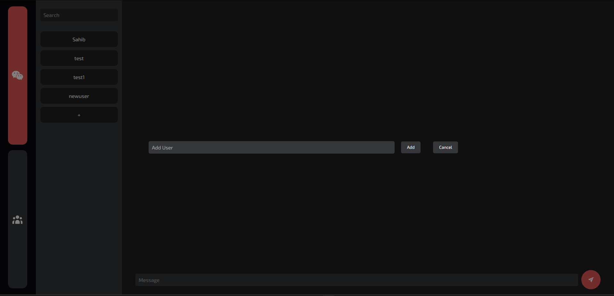

# Chat Application

## Description

This is a simple chat application that enables users to chat with each other. The application is built using Node.js, Express.js, and Socket.io.

## Table of Contents

- [Chat Application](#chat-application)
  - [Description](#description)
  - [Table of Contents](#table-of-contents)
  - [Installation](#installation)
  - [Usage](#usage)
  - [License](#license)
  - [Contribution](#contribution)
  - [Test](#test)
  - [Features](#features)
  - [Questions](#questions)
  - [Credits](#credits)
  - [Screenshots](#screenshots)

## Installation

To install dependencies, run the following:

```
npm install
```

## Usage

After installing the dependencies, run the application with:

```
node server.js
```

The application will be accessible at http://localhost:3000.

## License

This repository is licensed under the MIT license.

## Contribution

This repository is personal and is not accepting contributions.

## Test

To run tests, use the following command:

```
npm test
```

## Features

- Allows users to:
  - Create a username
  - Chat with other users
  - Create a room
  - Join a room
  - Leave a room
  - See who is in the room

## Questions

If you have any questions about this repository, feel free to contact me at [prathamlalwani33@gmail.com](mailto:prathamlalwani33@gmail.com). You can also view more of my work on GitHub at [PrathamLalwani](https://github.com/PrathamLalwani).

## Credits

- [PrathamLalwani](https://github.com/PrathamLalwani)
- [w3schools](https://www.w3schools.com/)
- [Stack Overflow](https://stackoverflow.com/)
- [Node.js](https://nodejs.org/en/)
- [Express.js](https://expressjs.com/)
- [Socket.io](https://socket.io/)

## Screenshots



